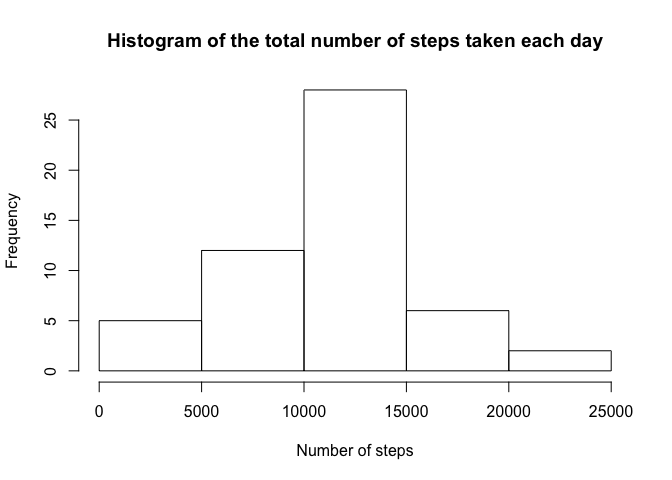
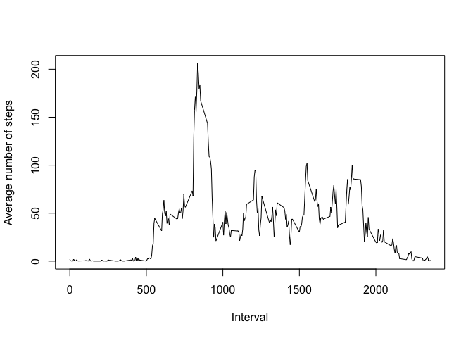
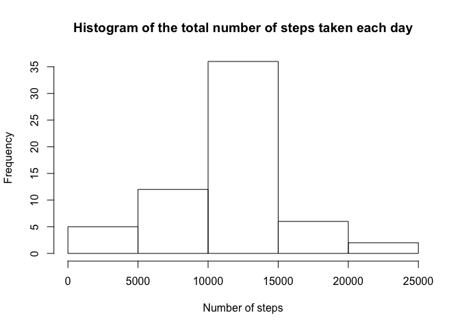
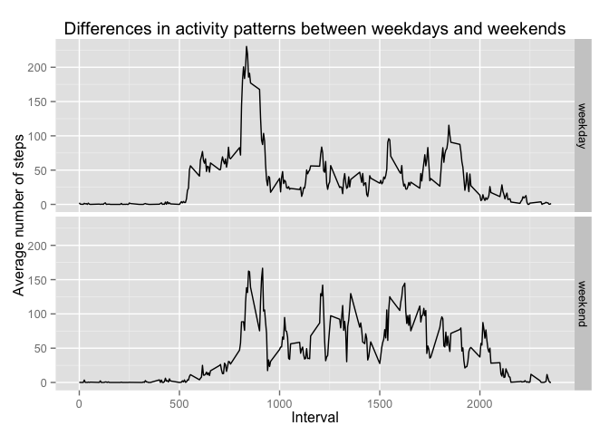

# Reproducible Research: Peer Assessment 1


## Loading and preprocessing the data


```r
doc <- unzip("activity.zip")
activity <- read.csv(doc)
```


## What is mean total number of steps taken per day?

Here is the histogram of total number of steps taken each day.

```r
date_steps <- aggregate(steps ~ date, activity, sum)  # calculate total number of steps taken each day.
hist(date_steps$steps, xlab = "Number of steps", main = "Histogram of the total number of steps taken each day")
```

 


```r
mean_steps <- as.integer(round(mean(date_steps$steps)))
median_steps <- median(date_steps$steps)
```

The mean and median of the total number of steps taken per day are 10766 and 10765, respectively.

## What is the average daily activity pattern?
Here is a time series plot of the 5-minute interval (x-axis) and the average number of steps taken, averaged across all days (y-axis).

```r
interval_steps <- aggregate(steps ~ interval, activity, mean)
with(interval_steps, plot(interval, steps, type = "l", xlab = "Interval", ylab = "Average number of steps"))
```

 


```r
interval_max <- interval_steps[which.max(interval_steps$steps), "interval"]
```
Interval 835 contains the maximum number of steps averaged across all days.

## Imputing missing values

```r
na_number <- length(which(is.na(activity$steps)))
```
The total number of missing values in the dataset is 2304.

The missing value is imputed by the mean for the 5-minute internal.

```r
for (i in 1 : nrow(activity)) {
        if (is.na(activity$steps[i])) {
                interval_val <- activity$interval[i]
                row_id <- which(interval_steps$interval == interval_val)
                activity$steps[i] <- interval_steps$steps[row_id]
        }
}
```

Here is the histogram of the total number of steps taken each day.

```r
date_steps_imputed <- aggregate(steps ~ date, activity, sum)
hist(date_steps_imputed$steps, main = "Histogram of the total number of steps taken each day", xlab = "Number of steps")
```

 


```r
mean_steps_imputed <- as.integer(mean(date_steps_imputed$steps))
median_steps_imputed <- as.integer(median(date_steps_imputed$steps))
```

Both the mean and median total number of steps taken per day are 10766. Due to the imputation, the former remains the same while the latter changes slightly.

## Are there differences in activity patterns between weekdays and weekends?


```r
activity$date <- as.Date(activity$date)
activity$day <- weekdays(activity$date)

for (i in 1 : nrow(activity)) {
        if (activity$day[i] == "Saturday" || activity$day[i] == "Sunday") {
                activity$day_type[i] <- "weekend"
        } else {
                activity$day_type[i] <- "weekday"
        }
}

activity$day_type <- as.factor(activity$day_type)
interval_steps_imputed <- aggregate(steps ~ interval + day_type, activity, mean)

library(ggplot2)
g <- ggplot(interval_steps_imputed, aes(x = interval, y = steps)) 
g <- g + geom_line()
g <- g + facet_grid(day_type ~ .)
g <- g + labs(title = "Differences in activity patterns between weekdays and weekends", x = "Interval", y = "Average number of steps")
g
```

 
